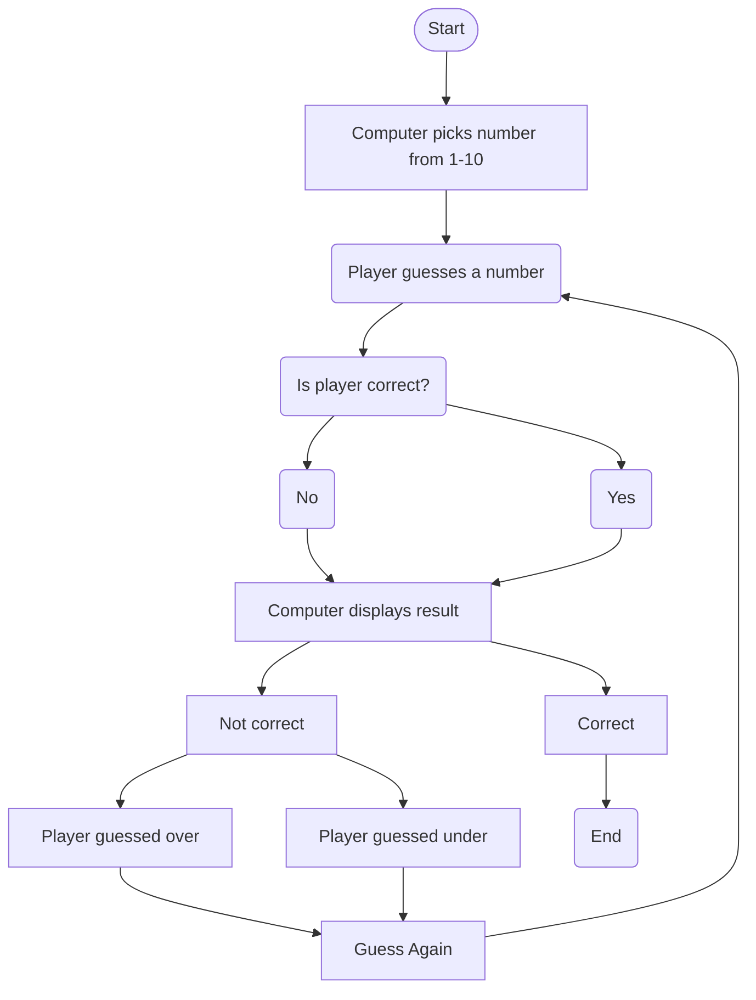

## Step by step breakdown
1. Program is started
2. Computer chooses its number between 1 and 10, keeps it secretly from the user
3. Player guesses a digit between 1 and 10, locked to only numbers with the `<input max=10 min=1 type="number">` tag restricting from anything else
4. Computer checks if the players number is equal to the computers number
5. If it is right, it will display the result "Correct" and end the program
6. If it is wrong, it displays the result "Not Correct"
7. It checks if the users digit is either greater than or less than its number and displays the result of either "Over" or "Under"
8. The user is prompted to guess again returning to step 3.
